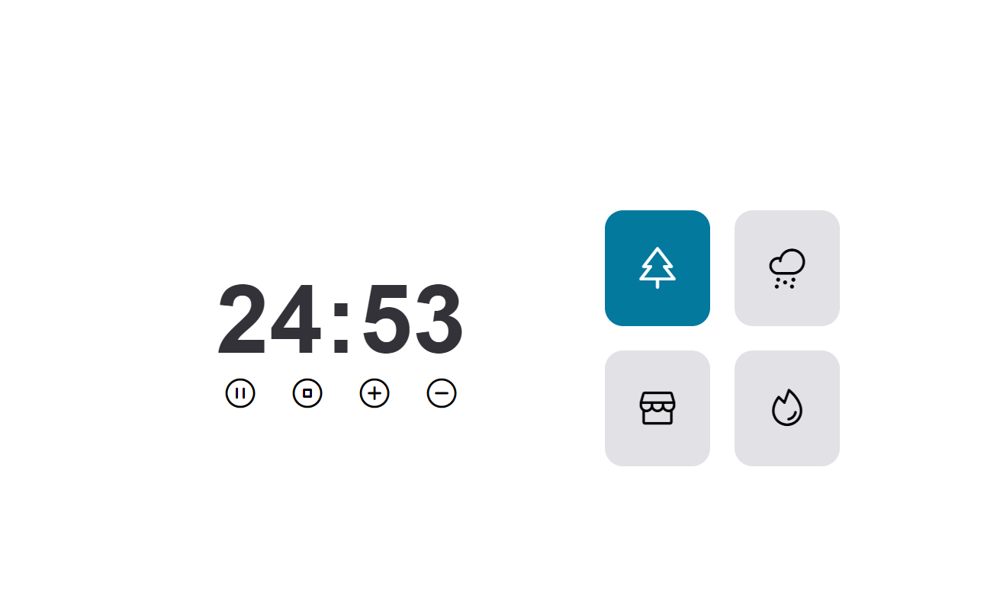

# Desafio FocusTimer 2.0
## Sobre o Desafio

 Este projeto é resultado do Desafio FocusTimer 2.0 proposto pela Rocketseat. O objetivo era aplicar os conceitos recentemente aprendidos em JavaScript, implementando uma aplicação de timer com funcionalidades específicas.

## Funcionalidades Implementadas

 Cada card à direita, quando selecionado, muda de cor e emite um som específico. (Floresta, Chuva, Cafeteria, Lareira) 

<ul>
 <li> Layout Responsivo </li>
  <li> Play: Inicia o timer.</li>
  <li> Pause: Parar o timer.</li>
  <li> Stop: reset(finaliza o timer). </li>
   <li> +: Aumenta o tempo do timer em 5 minutos. </li>
   <li> -: Diminui o tempo do timer em 5 minutos. </li>
   
</ul>

### Recursos Utilizados
<ul>
  <li> Layout do Figma.</li>
 
 
  